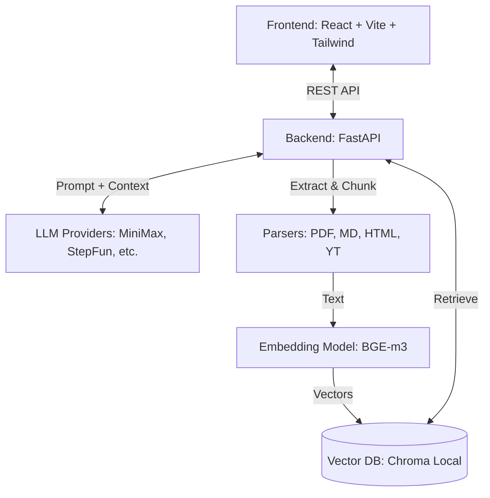

# Architecture

## 1. 系统概览

uni-rag 采用典型的前后端分离架构，后端为轻量化处理节点（负责文档解析、嵌入和路由），前端为单页应用（负责状态管理和视图渲染），向量存储使用本地 Chroma。

## 2. 核心模块说明

### Frontend (React)
- **位置**: `/frontend/src/`
- **状态管理**: 纯 React State + `localStorage`（用于保存 provider 偏好、API Key 和 Session ID）。
- **组件结构**:
  - `App.tsx`: 主入口，包含欢迎页、工具条、聊天窗口及主界面逻辑。
  - `components/MatrixBackground.tsx`: 登录页视觉背景。
- **渲染**: 借助 `react-markdown`、`remark-math` 等实现 Markdown 与公式的混合渲染。

### Backend (Python/FastAPI)
- **位置**: `/src/uni_rag/`
- **Ingestion Pipeline** (`ingest/`):
  - **File Parser**: 处理 `.pdf` (pdfplumber) 和 `.md`。
  - **URL Extractor**: 基于 `trafilatura` (Web) 和 `youtube-transcript-api` (Video) 将链接映射为纯文本。
  - **Chunker**: 按 Token 长度进行语义分块。
  - **存储流**: Chunk -> BGE-m3 Embedding -> 写入 `~/.uni-rag/db` (Chroma)。
  - **注意**: URL 源不会在磁盘生成物理文件，只存在于 Chroma 的元数据中；因此前端查询文档列表走的是 `/api/sources` (扫 DB Metadata)，而不是扫本地目录。
  
### LLM Provider Abstraction
- **位置**: `/src/uni_rag/llm/client.py`
- 支持根据前端传入的 `provider` 字段动态初始化不同的后端推理引擎（基于 OpenAI 兼容协议或 Anthropic 兼容协议）。

## 3. 数据与依赖流
- **数据库路径**: 默认保存在 `~/.uni-rag/db` (由 Chroma 托管)。
- **网络流**: 
  - 前端请求发往 `localhost:5173`。
  - Vite dev server 将 `/api/*` 请求代理转发至 `localhost:5001` (FastAPI 端口)。
  - FastAPI 在入站时可能需要出网（请求 YouTube 字幕或网页 HTML）。
  - FastAPI 在查询时必须出网（请求外部大模型 API）。

## 4. 后续演进点 (Tech Debt)
- 缺乏基于 Playwright 的前端自动化 UI 测试。
- 缺乏对 `/api/sources` 针对大型 Chroma 库的翻页/性能优化。